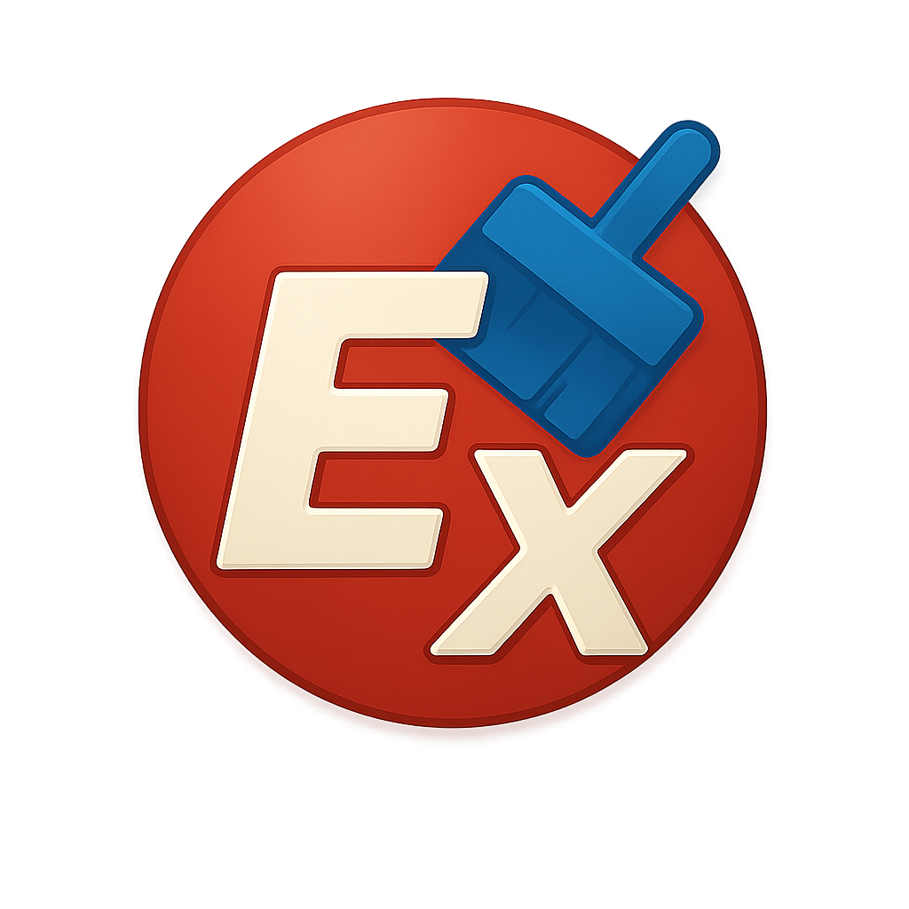
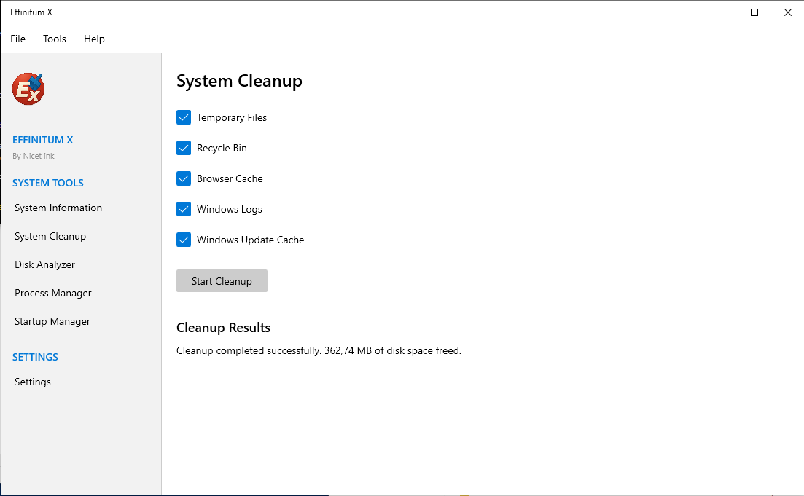
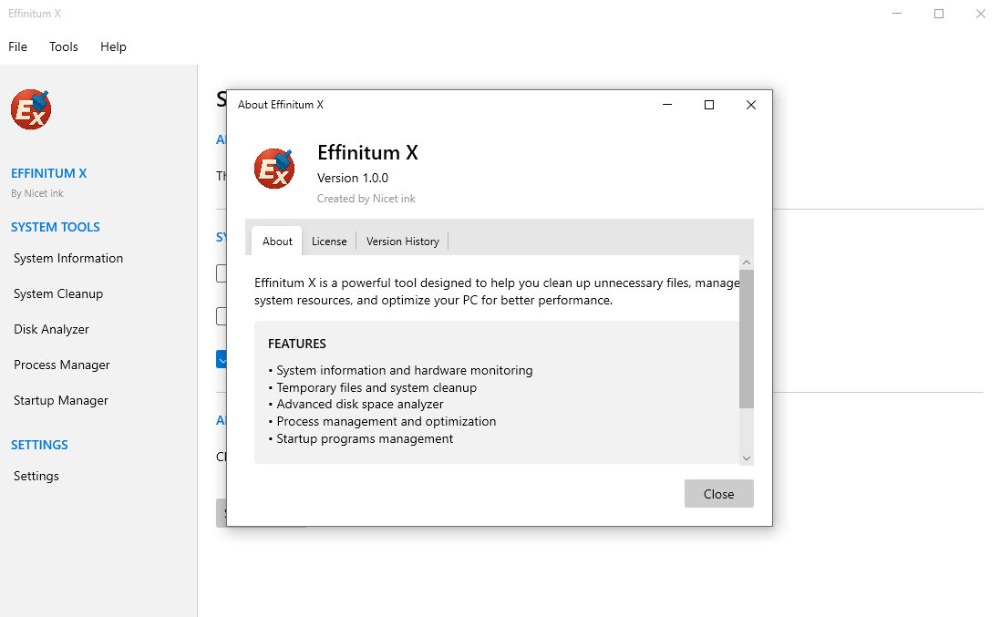

# Effinitum X



Effinitum X is a powerful Windows system optimization and cleanup application.

## Features

- **System Information**: Detailed information about CPU, memory, disks, and other system components
- **System Cleanup**: Remove temporary files, clean recycle bin, browser cache, and other unnecessary files
- **Disk Analyzer**: Find and visualize large files to free up disk space
- **Disk Optimization**: Check and optimize your disks with CHKDSK and defragmentation tools
- **Process Manager**: View and manage running processes with the ability to terminate them
- **Startup Manager**: View and optimize programs that start with Windows
- **UWP Apps Manager**: View and uninstall UWP applications from your system
- **Windows Defender Control**: Enable or disable Windows Defender with a single click
- **Windows Update Manager**: Control Windows Update service to stop automatic updates
- **Zapret-Discord-YouTube Integration**: Helps to bypass Discord and YouTube blocks in certain regions
- **Gaming Mode**: Optimize system performance for gaming
- **Multi-language Support**: Available in 5 languages

## Screenshots





## System Requirements

- Windows 10 or Windows 11
- .NET 9.0 or higher
- 50 MB of free disk space
- 2 GB RAM
- Administrator rights (required for some features)

## Installation

1. Download the latest release from the [releases page](https://github.com/Nicetink/EffinitumX/releases)
2. Install to disk
3. Run `Effinitum X.exe`

## Building from Source

```
git clone https://github.com/Nicetink/Effinitum-X.git
cd EffinitumX
dotnet build --configuration Release
```

## Latest Changes (v1.9.5)

• Added system animations control and customization
• Added multiple animation presets from minimal to maximum
• Added ability to restore all system animations
• Improved user interface with custom window buttons
• Complete English translation of the application
• Added "Official Version" designation
• Fixed various UI bugs and performance issues
• Enhanced startup and shutdown performance
## Previous Updates

### v1.6.0
- Added automatic updates from GitHub repository
- Improved logging system with new Logger class
- Fixed "Value cannot be null (Parameter 'value')" error on startup
- Enhanced application loading screen with progress indicator
- Optimized application initialization process
- General performance and stability improvements

### v1.2.2
- Added UWP apps management and uninstallation
- Added Windows Defender control
- Added Windows Update management
- Added Zapret-Discord-YouTube integration
- Added disk optimization with CHKDSK and defrag
- Improved user interface with navigation view
- Various bug fixes and performance improvements

## License

This project is distributed under the MIT License. See the LICENSE file for details.

## Author

Created by Nicet ink © 2025 